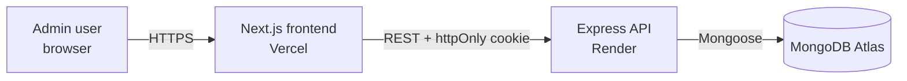
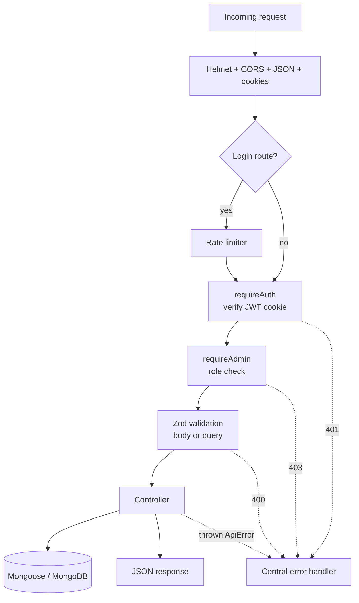
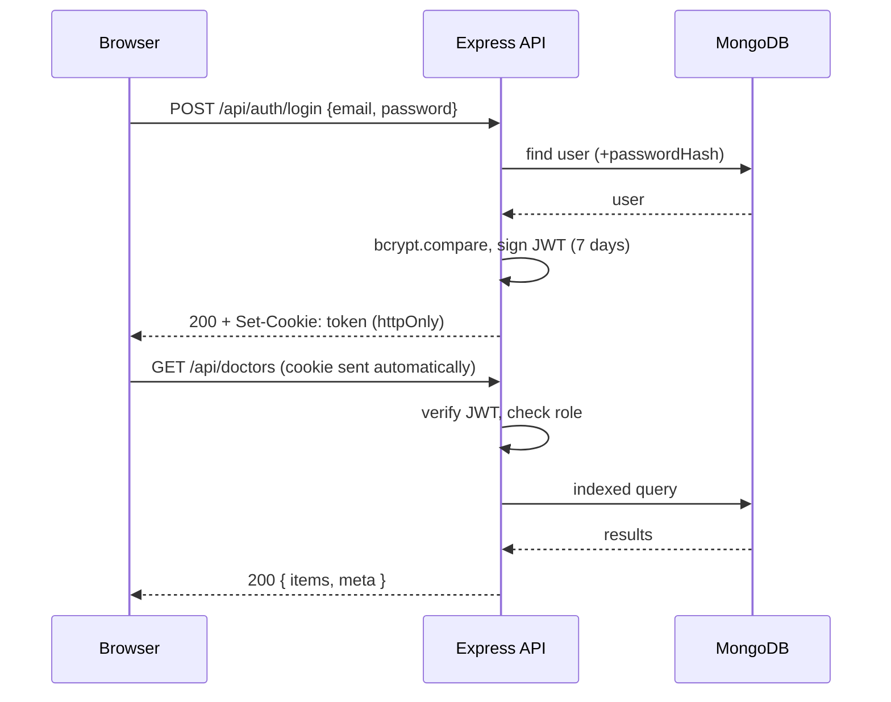
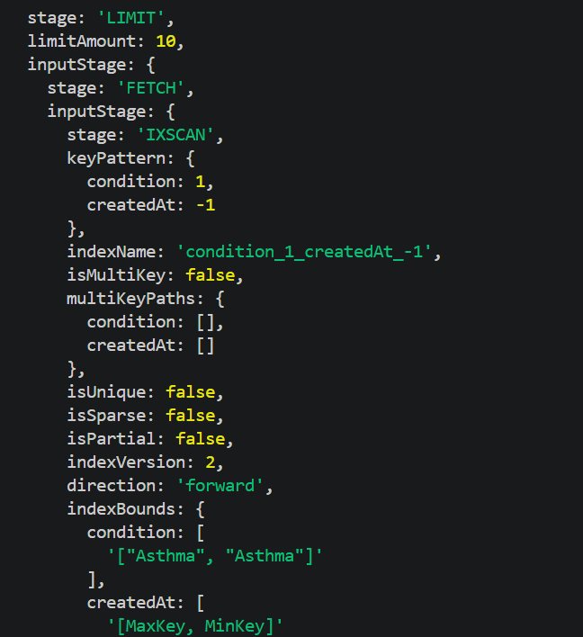
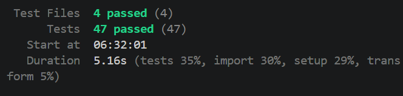
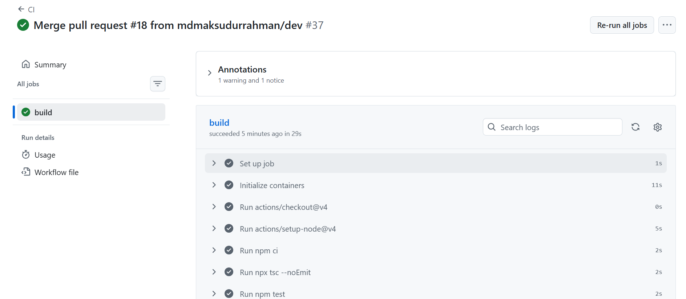

# Doctor Tracker API


## Elevator Pitch

Doctor Tracker is a secure administrative portal for managing doctors and their patients. This repository is its standalone REST API: an Express + TypeScript server on top of MongoDB that handles cookie-based JWT authentication, doctor and patient management with indexed search, filtering and pagination, and aggregation-powered analytics for the admin dashboard. It is built around query performance, with every list endpoint backed by a purpose-designed compound index, and it is covered by an automated test suite that runs against a real MongoDB instance in CI.

| | |
|---|---|
| **Live API** | `https://doctor-tracker-api-cx5r.onrender.com` (health check: `/api/health`) |
| **Live frontend** | `https://doctor-tracker-web-gamma.vercel.app` |
| **Frontend repository** | `https://github.com/mdmaksudurrahman/doctor-tracker-web` |
| **Demo login** | Email: `admin@doctortracker.com` / Password: `Admin@12345` |

> The API is hosted on Render's free tier, which sleeps after about 15 minutes of inactivity. The first request after a quiet period can take 30 to 60 seconds. Open `/api/health` once to wake it up.

---

## Table of Contents

1. [Features](#features)
2. [Tech Stack](#tech-stack)
3. [Setup Guide](#setup-guide)
4. [System Architecture](#system-architecture)
5. [API Reference](#api-reference)
6. [Data Model and Indexes](#data-model-and-indexes)
7. [Technical Decisions](#technical-decisions)
8. [Visual Evidence](#visual-evidence)
9. [Testing](#testing)
10. [Git Workflow and CI](#git-workflow-and-ci)
11. [Deployment](#deployment)
12. [Scalability and Known Limitations](#scalability-and-known-limitations)

---

## Features

- **Authentication:** email and password login, JWT in an `httpOnly` cookie, rate-limited login endpoint, protected routes with separate authentication (`requireAuth`) and authorization (`requireAdmin`) middleware.
- **Doctor management:** create, list, view and delete doctors. Search, filter by specialization, hospital and creation date, sort, and paginate.
- **Doctor's patients:** list, add and remove patients under a specific doctor.
- **Patient management:** global patient list with search, filters (condition, gender, doctor, date range), sorting and pagination. Edit (including reassigning to another doctor) and delete.
- **Dashboard analytics:** total doctors and patients, new records in a date range, average patients per doctor, top doctors by patient count, daily patient trend (zero-filled), and condition, gender and specialization breakdowns.
- **Engineering practices:** Zod validation for env vars, bodies and query strings, a central error handler, security headers (Helmet), CORS with credentials, 47 integration tests, and GitHub Actions CI.

## Tech Stack

| Area | Technology |
|---|---|
| Runtime | Node.js 20+ |
| Framework | Express |
| Language | TypeScript |
| Database | MongoDB with Mongoose |
| Validation | Zod |
| Auth | JSON Web Tokens (`jsonwebtoken`), `bcryptjs`, `cookie-parser` |
| Security | Helmet, CORS, `express-rate-limit` |
| Testing | Vitest, Supertest |
| CI | GitHub Actions (with a MongoDB service container) |
| Hosting | Render (API), MongoDB Atlas (database) |

---

## Setup Guide

### Prerequisites

- [Node.js](https://nodejs.org/) 20 or newer
- [Docker](https://www.docker.com/) (for a local MongoDB). If you don't have Docker, use a free MongoDB Atlas cluster and paste its connection string into `.env` instead.
- Git

### 1. Clone and install

```bash
git clone https://github.com/mdmaksudurrahman/doctor-tracker-api.git
cd doctor-tracker-api
npm install
```

### 2. Start MongoDB

```bash
docker compose up -d
```

This starts MongoDB 7 on `localhost:27017` with a persistent volume.

### 3. Configure environment variables

Copy the example file and adjust it if needed:

```bash
# macOS / Linux
cp .env.example .env

# Windows PowerShell
Copy-Item .env.example .env
```

`.env.example`:

```env
PORT=5000
MONGODB_URI=mongodb://localhost:27017/doctor-tracker
JWT_SECRET=change-this-to-a-long-random-string
CLIENT_URL=http://localhost:3000
NODE_ENV=development

# Used only by the seed:admin script
ADMIN_EMAIL=admin@doctortracker.com
ADMIN_PASSWORD=Admin@12345
```

| Variable | Description |
|---|---|
| `PORT` | Port the API listens on (Render sets this automatically) |
| `MONGODB_URI` | MongoDB connection string |
| `JWT_SECRET` | Secret used to sign tokens. Minimum 16 characters |
| `CLIENT_URL` | Exact origin of the frontend, used for CORS |
| `NODE_ENV` | `development`, `production` or `test` |
| `ADMIN_EMAIL`, `ADMIN_PASSWORD` | Credentials created by `npm run seed:admin` |

The server validates these at startup and exits with a clear error if one is missing or invalid.

### 4. Create the admin user and demo data

```bash
npm run seed:admin   # creates (or updates) the admin account
npm run seed         # 30 doctors and 400 patients of realistic demo data
```

`npm run seed` clears the doctors and patients collections before inserting. It never touches the admin user.

### 5. Run the API

```bash
npm run dev
```

Open `http://localhost:5000/api/health`. You should see `{"status":"ok"}`.

### 6. Run the tests (optional)

```bash
npm test
```

Tests use a separate database (`doctor-tracker-test`) on the same MongoDB instance.

### Available scripts

| Script | Purpose |
|---|---|
| `npm run dev` | Start the API with hot reload (`tsx watch`) |
| `npm run build` | Compile TypeScript to `dist/` |
| `npm start` | Run the compiled server |
| `npm test` | Run the full test suite once |
| `npm run test:watch` | Run tests in watch mode |
| `npm run seed:admin` | Create or update the admin user |
| `npm run seed` | Reset and fill doctors and patients with demo data |

### Project structure

```
src/
  config/        env validation, database connection
  controllers/   request handlers (auth, doctor, patient, dashboard)
  middleware/    requireAuth / requireAdmin, Zod validation
  models/        Mongoose schemas and indexes (User, Doctor, Patient)
  routes/        route definitions, one file per resource
  validators/    Zod schemas for request bodies and query strings
  scripts/       seed:admin and seed
  utils/         ApiError, asyncHandler, escapeRegex
  app.ts         Express app (no listen, so tests can import it)
  server.ts      entry point: connect to DB, then listen
tests/           Vitest + Supertest integration tests
```

---

## System Architecture

### High-level view



The frontend and backend are separate applications in separate repositories. They communicate only through the REST API.

### Request pipeline



### Login flow



### Layering

Routes declare the middleware chain for each endpoint, validators define what valid input looks like, and controllers contain the data logic. Controllers never parse raw input (validation has already run) and never format errors (the central handler does). `app.ts` exports the Express app without calling `listen`, which lets Supertest drive the real app in tests without opening a port.

### Error format

All errors share one shape, so the frontend can handle them uniformly:

```json
{ "message": "Validation failed", "errors": { "age": ["Too big: expected number to be <=130"] } }
```

`errors` appears only on validation failures. 5xx responses return a generic message and never leak internals.

---

## API Reference

All routes except `/api/health` and `/api/auth/login` require a valid auth cookie.

### Auth

| Method | Endpoint | Description |
|---|---|---|
| POST | `/api/auth/login` | Log in, sets the `token` cookie. Limited to 20 attempts per 15 minutes per IP |
| POST | `/api/auth/logout` | Clears the cookie |
| GET | `/api/auth/me` | Returns the current user |

### Doctors

| Method | Endpoint | Description |
|---|---|---|
| GET | `/api/doctors` | List with `q`, `specialization`, `hospital`, `from`, `to`, `sort`, `page`, `limit` |
| POST | `/api/doctors` | Create a doctor (`409` if the email exists) |
| GET | `/api/doctors/filters` | Distinct specializations and hospitals for filter dropdowns |
| GET | `/api/doctors/:id` | Get one doctor |
| DELETE | `/api/doctors/:id` | Delete a doctor and their patients |
| GET | `/api/doctors/:id/patients` | List that doctor's patients (same query params as the patient list) |
| POST | `/api/doctors/:id/patients` | Add a patient under the doctor |
| DELETE | `/api/doctors/:id/patients/:patientId` | Remove a patient from that doctor |

### Patients

| Method | Endpoint | Description |
|---|---|---|
| GET | `/api/patients` | List with `q`, `condition`, `gender`, `doctor`, `from`, `to`, `sort`, `page`, `limit` |
| GET | `/api/patients/filters` | Distinct conditions for the filter dropdown |
| PATCH | `/api/patients/:id` | Update any subset of fields, including reassigning `doctor` |
| DELETE | `/api/patients/:id` | Delete a patient |

### Dashboard

| Method | Endpoint | Description |
|---|---|---|
| GET | `/api/dashboard/stats?days=30` | All dashboard data for the last `days` days (7 to 365) |

### Common query parameters

| Param | Values | Default |
|---|---|---|
| `page` | integer, 1 or more | `1` |
| `limit` | integer, 1 to 50 | `10` |
| `sort` | `newest`, `oldest`, `name` | `newest` |
| `from`, `to` | ISO dates, inclusive range on `createdAt` | none |

List responses look like this:

```json
{
  "items": [],
  "meta": { "total": 30, "page": 1, "limit": 10, "totalPages": 3 }
}
```

### Dashboard response shape

```json
{
  "range": { "days": 30, "from": "2026-09-03T00:00:00.000Z" },
  "totals": { "doctors": 30, "patients": 400, "newDoctors": 10, "newPatients": 285, "avgPatientsPerDoctor": 13.3 },
  "patientsPerDoctor": [{ "doctorId": "...", "name": "Dr. ...", "specialization": "...", "count": 77 }],
  "patientsOverTime": [{ "date": "2026-09-03", "count": 2 }],
  "conditions": [{ "name": "Asthma", "count": 48 }],
  "genders": [{ "name": "female", "count": 141 }],
  "specializations": [{ "name": "Cardiology", "count": 3 }]
}
```

---

## Data Model and Indexes

Patients live in their own collection and reference a doctor, instead of being embedded in the doctor document. That keeps pagination, global search and filtering cheap, and avoids an unbounded array growing inside a document.

### Collections

| Collection | Fields |
|---|---|
| `users` | name, email (unique), passwordHash (`select: false`), role |
| `doctors` | name, specialization, hospital, phone, email (unique), timestamps |
| `patients` | name, age, gender, condition, phone, doctor (ref), timestamps |

### Indexes

| Collection | Index | Serves |
|---|---|---|
| doctors | `{ createdAt: -1 }` | Default list order, date range filter |
| doctors | `{ specialization: 1, createdAt: -1 }` | Specialization filter, newest first |
| doctors | `{ hospital: 1, createdAt: -1 }` | Hospital filter, newest first |
| doctors | `{ email: 1 }` unique | Duplicate prevention |
| doctors | text on name, specialization, hospital (weighted) | Reserved for whole-word search |
| patients | `{ doctor: 1, createdAt: -1 }` | A doctor's patients, newest first |
| patients | `{ condition: 1, createdAt: -1 }` | Condition filter, newest first |
| patients | `{ createdAt: -1 }` | Default list order, daily trend aggregation |
| patients | text on name, condition | Reserved for whole-word search |

In every compound index the equality field comes first and the sort field last, so MongoDB filters and sorts from the index without an in-memory sort.

### Query patterns

- **Pagination:** `find().sort().skip().limit()` and `countDocuments()` run in parallel with `Promise.all`. `limit` is capped at 50.
- **Lean reads:** list queries use `.lean()` to return plain objects, which is faster and lighter than hydrated Mongoose documents.
- **Projected joins:** `populate("doctor", "name specialization")` fetches only the fields the UI shows.
- **Group first, join later:** the "top doctors" aggregation groups patients by doctor, limits to 10, and only then runs `$lookup`, so it joins 10 documents instead of every patient.
- **Parallel aggregations:** the dashboard runs its queries concurrently with `Promise.all`; each hits the index that suits it.
- **Cheap totals:** overall counts use `estimatedDocumentCount()`, which reads collection metadata instead of scanning.

---

## Technical Decisions

### Decision 1: JWT in an `httpOnly` cookie instead of `localStorage`

**Context.** The portal is admin-only and handles patient data, and the spec asks for secure login and properly protected routes. The common tutorial approach is to return a JWT in the response body and keep it in `localStorage`, attaching it as an `Authorization` header.

**Decision.** The API sets the token as an `httpOnly` cookie. The browser sends it automatically with every request, and JavaScript on the page can never read it.

**Why.**

- **XSS resistance.** Anything that runs in the page, such as a compromised dependency or an injected script, can read `localStorage` and steal the token. An `httpOnly` cookie is invisible to scripts, so a successful XSS can still act as the user while the page is open, but cannot exfiltrate a long-lived credential.
- **Route protection on the server.** Because the cookie travels with the page request itself, the Next.js side can check it before rendering a protected page and redirect unauthenticated visitors, with no flash of protected content. A `localStorage` token is invisible to the server, which forces client-side-only guards.
- **Simpler client code.** No token plumbing, no interceptors that attach headers, and logout is a single server call that clears the cookie.

**Trade-offs and how they are handled.**

- **CSRF.** Cookies are sent automatically, which creates CSRF exposure. Mitigations: `sameSite` is set (`lax` locally, `none` in production, where the API and frontend are on different sites), CORS only allows the configured `CLIENT_URL` with credentials, the API accepts only JSON bodies, and state-changing routes never use GET. A CSRF token would be the next hardening step.
- **Cross-site cookies in production.** With the frontend on Vercel and the API on Render, the cookie must be `secure` with `sameSite: "none"`, and `trust proxy` must be enabled because Render terminates TLS. The API switches these flags on `NODE_ENV`. Browsers increasingly restrict third-party cookies, so the frontend is designed to call the API through its own origin (a Next.js rewrite), which keeps the cookie first-party.
- **Statelessness.** The JWT is verified without a database lookup (the `/me` endpoint does check the user still exists). Tokens cannot be revoked individually before expiry (7 days); a refresh-token scheme with a short access token would address that at larger scale.

Additional hardening already in place: `bcrypt` with cost 12, identical error messages for unknown email and wrong password (no user enumeration), a rate limiter on login, `passwordHash` excluded from queries by default, and env validation that refuses a short `JWT_SECRET`.

### Decision 2: Word-prefix regex search instead of a MongoDB `$text` index

**Context.** The spec requires searching doctors and patients, with optimized queries. The user experience goal is search-as-you-type: typing `ayes` should find "Dr. Ayesha Rahman".

**Options considered.**

| Option | Result |
|---|---|
| `$text` index | Fast and ranked, but matches **whole words** only (`ayes` finds nothing), and cannot be combined with `$or`, so it can't search across fields alongside other conditions the way we need |
| Anchored regex `^ayes` | Can use an index, but only matches the start of the whole string. "Dr. Ayesha" starts with "Dr." so it fails |
| **Word-start regex** `(^\|[\s.])ayes`, case-insensitive | Matches the start of any word, works across several fields with `$or`, feels like real search-as-you-type |
| Atlas Search / Elasticsearch | Best quality (typo tolerance, ranking, partial matches), but adds infrastructure and ties the app to Atlas |

**Decision.** Use the word-start regex across name and specialization/hospital (doctors) or name and condition (patients). All user input goes through `escapeRegex()`, so characters like `.*` are treated as plain text and cannot cause regex injection or catastrophic patterns. A test confirms this.

**Consequences.**

- **Pros:** correct, intuitive results for typed prefixes; no extra service; other filters (specialization, date range, doctor) combine with search naturally in a single query.
- **Cons:** an unanchored, case-insensitive regex cannot use an index for the text match, so MongoDB scans the candidate documents. Structured filters (`doctor`, `condition`, date range) still narrow the set through their compound indexes first, and at the data volumes this app targets (thousands of records) latency is negligible.
- **Scale plan:** the text indexes are already defined on both collections. When the dataset grows into the hundreds of thousands, search should move to Atlas Search (autocomplete analyzer) or a dedicated search engine, and the controller's search block is the only code that would change.

---

## Visual Evidence

The API has no UI. Desktop and mobile screenshots of the application are in the frontend repository's README. Below is evidence of the backend's query performance.

### Index usage

A filter plus sort plus limit on patients is served entirely from the `{ condition, createdAt }` compound index: `LIMIT → FETCH → IXSCAN`, 10 documents examined for 10 returned, with no in-memory sort stage.

```bash
docker compose exec mongo mongosh doctor-tracker --quiet --eval "printjson(db.patients.find({condition:'Asthma'}).sort({createdAt:-1}).limit(10).explain('executionStats').queryPlanner.winningPlan)"
```



### Test run



### CI



> Add the screenshots above to `docs/screenshots/`.

---

## Testing

The suite uses **Vitest** and **Supertest** against a real MongoDB test database, not mocks, so unique indexes, aggregations, regex search and the cascade delete are exercised exactly as in production.

```bash
docker compose up -d
npm test
```

| File | Tests | Covers |
|---|---|---|
| `auth.test.ts` | 13 | health and 404, login success and failures, cookie flags, tampered token, logout, route protection |
| `doctors.test.ts` | 16 | create, duplicate email, validation, pagination meta, word-prefix search, regex escaping, filters, date range, sorting, cascade delete |
| `patients.test.ts` | 14 | doctor-scoped add, list and delete, ownership checks, global filters, update and reassignment, delete |
| `dashboard.test.ts` | 4 | empty state, aggregation correctness, zero-filled daily series, range validation |

**Total: 47 tests.** Safeguards: tests run in a database whose name must end in `-test` (the setup file refuses to run otherwise, so a wrong `.env` can never wipe real data), collections are emptied before every test so tests are independent, and test files run sequentially because they share one database.

---

## Git Workflow and CI

- `main`: production. Render deploys from it. Only receives merges from `dev`.
- `dev`: integration branch. Receives merges from feature branches.
- `feature/*`: one branch per module (`feature/models`, `feature/auth`, `feature/doctors-api`, `feature/patients-api`, `feature/dashboard-and-seed`, `feature/tests`, and so on).
- Every change reaches `dev` and `main` through a pull request. Branch protection requires the CI check to pass before merging.
- Commits follow Conventional Commits (`feat:`, `fix:`, `test:`, `chore:`, `ci:`).

The GitHub Actions workflow (`.github/workflows/ci.yml`) runs on every push and pull request to `dev` and `main`. It starts a MongoDB service container, installs dependencies with `npm ci`, type-checks with `tsc --noEmit`, runs the test suite, and builds the project.

---

## Deployment

### Database: MongoDB Atlas

1. Create a free M0 cluster, a database user, and allow network access from `0.0.0.0/0` (Render's free tier has no fixed IP).
2. Use a connection string that includes the database name: `mongodb+srv://<user>:<password>@<cluster>.mongodb.net/doctor-tracker?retryWrites=true&w=majority`.
3. Seed it once from a local machine by setting `MONGODB_URI` and `ADMIN_PASSWORD` for the session, then running `npm run seed:admin` and `npm run seed`.

### API: Render

| Setting | Value |
|---|---|
| Branch | `main` |
| Build command | `npm ci --include=dev && npm run build` |
| Start command | `npm start` |
| Health check path | `/api/health` |

`--include=dev` is required because Render sets `NODE_ENV=production`, which would otherwise skip the TypeScript compiler.

Environment variables: `NODE_ENV=production`, `MONGODB_URI`, `JWT_SECRET` (32+ random characters), and `CLIENT_URL` set to the exact deployed frontend origin (no trailing slash).

---

## Scalability and Known Limitations

**Already scalable by design**

- Indexed filters and sorts, capped page size, lean reads, projected joins.
- Patients in their own collection, so a doctor with 100,000 patients does not bloat a document.
- Stateless API (JWT), so it scales horizontally behind a load balancer.
- Group-then-lookup aggregations and metadata-based totals keep dashboard cost low.

**Known limitations and the planned next step for each**

| Limitation | Next step |
|---|---|
| `skip/limit` pagination slows down at very deep pages | Cursor-based (keyset) pagination on `createdAt` + `_id` |
| Unanchored regex search scans candidates | Atlas Search with an autocomplete analyzer |
| Deleting a doctor and their patients is two operations, not one transaction, so a crash between them could leave orphans | MongoDB transaction (requires a replica set; Atlas provides one) |
| Dashboard days are grouped in UTC, so late-evening records in UTC+6 appear on the next day | Pass a `timezone` option to `$dateToString` |
| `estimatedDocumentCount` can be briefly off after an unclean shutdown | Switch to `countDocuments` if exactness matters |
| Tokens cannot be revoked before they expire (7 days) | Short-lived access token plus a refresh token |
| Single admin role | Role-based permissions already have a hook in `requireAdmin` |

---

## License

MIT